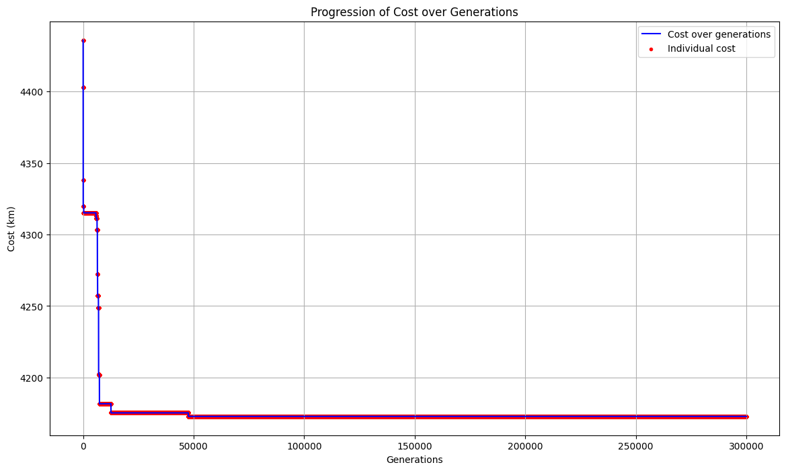

# CI2024_lab2

Computational Intelligence - Laboratory 2

In order to solve the Traveling Salesman Problem (TSP) I have implemented a solution with a Genetic Algorithm with Simulated Annealing. These are the results with `generations = 150_000, mutation_rate = 0.3, initial_temperature = 10_000.0, cooling_rate = 0.999, stagnation_limit = 5_000, adaptive_increase = 0.1` for the five files in the cities folder.

## Vanuatu

Final Best Path Cost: 1345.54 km.

## Italy

Final Best Path Cost: 4172.76 km.

## Russia

Final Best Path Cost: 33534.42 km

## USA

## China

collaborators: 
Lampidecchia Sergio s331080 https://github.com/sergiolampidecchia, Brizzi Marialuigia 334148 https://github.com/Mars1601 

